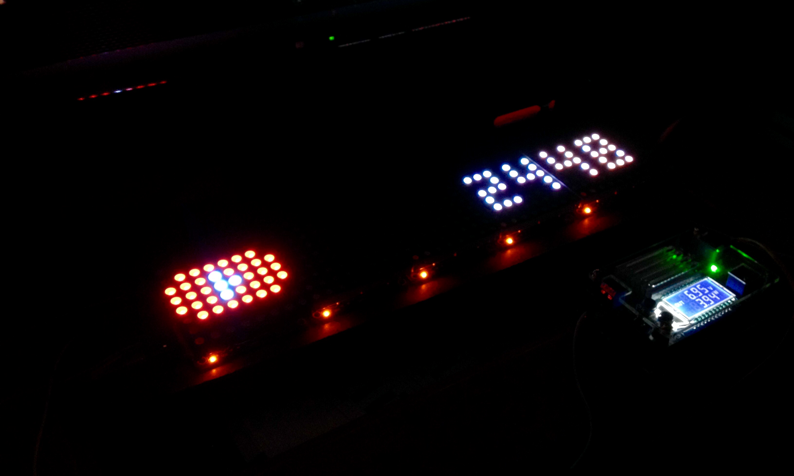

# LaColorduino - Your own Smartwatch how it should be

I build my own clone of LaMetric smartwatch but with 5 Colorduino. It will make use of an ESP8266 (01 or NodeMCU) for the connection to the Internet. It's build for everdays use like showing your Subscribers on YouTube, the current track on Spotify, how strong is the Euro, or the weather at the moment. There is (in the future) everthing for everbody and everthing is selfmade!

**Note: I got everything, so I'll start programming and this will take time. A hugh amount of time. I did some charset and logos but I need to write my own protocol for communication, parsing those information, control the matrix and many more. Meanwhile, I did a checklist to show you, what I (try) to programm them. Maybe somebody can help me, too. Maybe I need to change some parts like the ESP8266 (my sourcecode goes out of memory or similar) or the Step-down Power Supply is to weak. The Datasheet of the Colorduino isn't the best I ever read and there are at least 2 version of them. Don't worry, I try to help with and guide and something like a wiki here on github.  And last but not least, English isn't my native language but it's the language of programming. It help's more people on the world if you ask in english than in german!**
 
## I plan to add things like
* [ ] Twitch
  * [ ] View
  * [ ] Is live now
* [ ] Facebook Fan count
* [ ] Twitter followers
* [ ] YouTube
  * [ ] Total Subscribers
  * [ ] Total Comments
  * [ ] Total Watchtime
  * [ ] Total View
* [ ] Currency
  * [ ] Euro
  * [ ] US Dollar
  * [ ] British Pound
  * [ ] Yen
  * [ ] Bitcoin
* [ ] GoogleMail notification
* [ ] Steam Server state
* [ ] State for CS:GO (if I got it already running 😡😤)
  * [ ] Kills
  * [ ] Deaths
  * [ ] Time Played
  * [ ] Planted Bombs
  * [ ] Defused Bombs
  * [ ] Wins
  * [ ] Damage Done
  * [ ] Money Earned
  * [ ] Rescued Hostages
  * [ ] Headshot
  * [ ] MVP
  * [ ] Last Match
  * [ ] Weapon Kill
  * [ ] ...and many many many more
* [ ] Spotify
  * [ ] Current Track
* [X] [Weather](https://openweathermap.org/weather-conditions)
  * [X] Thunderstorm
  * [X] Drizzle
  * [X] Rain
  * [X] Snow
  * [X] Atmospere
  * [X] Clear
  * [ ] Moon Phase
  * [X] Clouds
  * [ ] Wind
* [ ] Indoor
  * [X] Temperature
  * [ ] Humidity
  * [ ] Barometric
  * [ ] (Air Quality, if I/you buy a CCS811 or similar)
* [ ] Github
  * [ ] Subscription (or something)
* [ ] Webinterface (to read data or change settings via web)
* [X] Update over-the-air (ESP8266 only)
* [ ] Calendar
* [ ] Clock (of course 😄)
## Software/Converter to program them
* Arduino [**1.6.0**](https://www.arduino.cc/en/Main/OldSoftwareReleases#previous) (Colorduino doesn't work properly on 1.8.6. It shows wrong color so you need to download an older version)
* Arduino 1.8.6 for ESP8266 (funny he?)
* [USB to TTL-Converter with CP2102](https://www.amazon.de/SODIAL-USB-TTL-Konverter-Modul-eingebautem-CP2102/dp/B008RF73CS/ref=sr_1_fkmr0_2?ie=UTF8&qid=1534713779&sr=8-2-fkmr0&keywords=cp2102+breakout) (or similar)
* (Library incoming)
* Help of the community
  * Testing
  * Bug fixing
  * Optimize
  * Adding feature

## Additional to the software, it requires some hardware
* 5x Colorduino Matrix Shield (it's possible up to 254 but never testing)
* 5x Colorduino Matrix 8x8 RGB LED Full Dot/Square (Feel free to mixed them up)
  * 1st shows the symbol/logo, everything else shows the information
* LDR (if it's dark, watchface change to clock with lowest light so you can sleep at night without any glare)
* 3x Button (not planed to use all of them at the moment)
* BME280 for indoor use
* ADS1115 or similar for those Buttons and LDR. (Yeah, 15-bit resolution is an overkill 😄)
* 5V-3.3V Level Shifter (if I use an ESP8266-01)
* DC-DC 12V to 5V and 3.3V Step-down Power Supply
  * We need at least 3.3V/5V for ESP8266 and 6.5V to 7.5V for RGB Matrix, at least 1A+.
* Messing Spacer (for mounting)

## Character Set
* [X] A-Z
* [x] a-z (it will convert to uppercase)
* [X] 0-9 (dec)
* [X] Semi-/colon
* [X] Simply Math operation
* [X] Punctuation
* [X] Number sign
* [X] Brackets
* [X] Underscore
* [X] Guillemets
* [X] Question mark
* [X] Space
* [X] At-Sign
* [X] Tilde
* [ ] And-Sign
* [ ] Dollar
* [ ] Ä, Ö, Ü, É, etc.
* [ ] [Japanese Katakana](http://www.electronic-engineering.ch/microchip/datasheets/lcd/charset.gif)
* [ ] ...

## Worksteps for Slave Colorduino's
* [X] Read and Parse Integer
* [X] Print Integer on Colorduino
* [X] Read and Parse Float
* [X] Print Float on Colorduino
* [ ] Read and Parse Char
* [ ] Print Char on Colorduino
* [X] Read and Parse String
* [ ] Print String on Colorduino
* [ ] Scroll String on Colorduino across
* [X] OTA for ESP8266 implementation (not optimized, yet)
* [ ] Print progressbar on Colorduino while Updating ESP8266
* [ ] Print progressbar on Colorduino for Widget (e.g. Spotify Track position)
* [ ] Boot Logo/Animation
* [ ] White-Balance Testscreen
* [ ] Wait until all devices are ready (or something similary for sync)
* [ ] Enable I²C
* [ ] ...

## Worksteps for Master Colorduino
* [ ] Enable I²C
* [ ] Sync all Colorduino
* [ ] Timer for changing Widget
* [ ] ...

## Worksteps for ESP8266
* [X] WiFi connection
* [ ] WiFi Manager
* [X] OTA for ESP8266 implementation
* [ ] EEPROM for Setting
* [ ] Webpage for Settings and Debug
* [ ] Enable I²C
* [X] Parsing Sensors
* [X] Parsing Button
* [X] Parsing Ambientlight
  * [ ] Hysteresis
* [ ] Compute all Information's
* [ ] Optimize Watchdog for reset after some weeks (~44 Days)
* [ ] ...

## Worksteps for circuit board
* [ ] Soldering all parts
* [ ] ...

## Worksteps for mounting
* [ ] Backplate (Wood, Metal or Plastic)
* [ ] Baking paper for diffusing light
* [ ] Black Glass/Plastic for lowering brightness after diffusing light
* [ ] Mounting on messing spacer and screw's
* [ ] Two holes for mounting on the Wall
* [ ] ...

## Worksteps for Github
* [ ] Learn english (orthography etc. 😄)
* [ ] Create a Wiki/Guide
  * [ ] ...in english and german
* [ ] Create a Flowchart
* [ ] eBook ready to Download with all Information and Tutorial
* [ ] Create two videos and share it on [Twitter](https://twitter.com/TheAmadeus25)/[YouTube](https://www.youtube.com/channel/UCwWUDIxHP5eyUSW02_msNTw)/Facebook
* [ ] Say "Thank You" for all who helped me
* [ ] Say "Thank You" for those who shared they library
* [ ] ...
